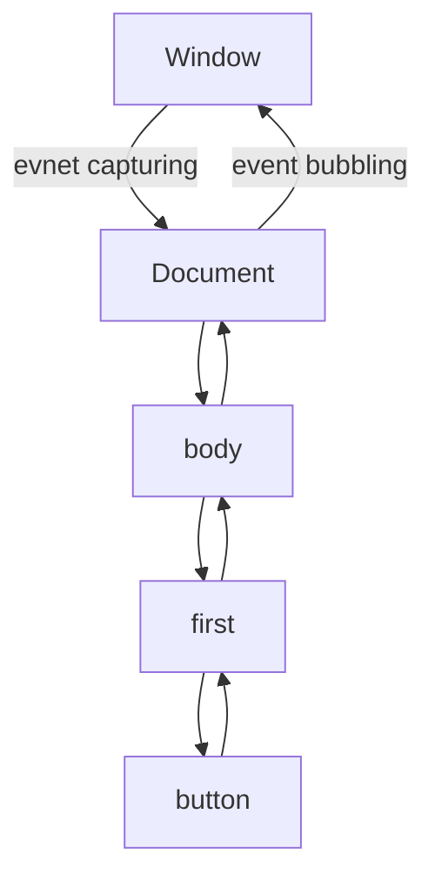

## 이벤트 발생 순서

자바스크립트에서는 이벤트를 발생시키는 순서가 존재한다. 이벤트 캡쳐링 단계(Event Capturing Phase)와 이벤트 버블링 단계(Event Bubbling Phase)가 그것이다.

기본적으로 이들은 이벤트가 겹쳐 있을 때, 이벤트가 어떻게 실행되어야 하는지에 대한 지표가 된다. 웹에서는 이벤트가 겹쳐져 있는 경우가 많으므로, 이를 컨트롤 하기 위한 방법들이 존재한다.

### 이벤트 캡쳐링(Event Capturing)과 이벤트 버블링(Event Bubbling)



이벤트 캡쳐링은 위에서 아래로 이벤트가 발생되는 이벤트 흐름이다. 최상단의 Window객체부터 최하단 요소인 button에 이르기 까지 이벤트가 순차적으로 발생한다.

이벤트 버블링은 이벤트 캡쳐링의 반대로 향하는 이벤트 발생 흐름이다. 이벤트를 버블링 국면에서 발생하도록 설정하면, 최하단 요소인 button에서 부터 최상단 객체인 Window 객체 순서로 이벤트가 발생하게 된다.

## 이벤트 발생 예시

```html
<!DOCTYPE html>
<html>
<head>
  <meta charset='utf-8'>
  <title>Events</title>
  <style>
    .first { width:60px; height:60px; background: blue; }
    .body { width:90px; height:90px; background: green; }
  </style>
</head>
<body class="body item">
  <div class='first item'>
    <input type='checkbox' class='checkbox item'/>
  </div>

  <script>
    var items = document.getElementsByClassName('item');
    for (var i = 0; i < items.length; i++) {
      (function() {
        var y = i;
        items[y].addEventListener('click', function(event) {
          console.log(this, event);
        }, false); // false가 default값, event bubbling
      })();
    }
  </script>
</body>
</html>
```

위의 코드를 브라우저에서 실행해서 버튼을 클릭하면 콘솔에 로그가 찍히는걸 볼 수 있다. 26번째 줄에서 true 혹은 false를 설정함으로써 이벤트 발생 시점을 컨트롤 할 수 있다.

### 이벤트 캡쳐링

```javascript
(function() {
  var y = i;
  items[y].addEventListener('click', function(event) {
    console.log(this, event);
  }, true); // true일 때 event capturing
})();
```

5번째 줄의 값이 true 때, 이벤트 캡쳐링 순서로 이벤트를 호출하게 된다. 이벤트 캡쳐링은 상위 오브젝트에서 하위 오브젝트로 이어지는 이벤트 흐름이기 때문에 콘솔에는 다음과 같이 찍히게 된다.

```html
<body ...> // MouseEvent
<div ...> // MouseEvent
<button ...> // MouseEvent
```

### 이벤트 버블링

버블링은 캡쳐링과 흐름이 역순이다. 즉 하위 오브젝트에서 상위 오브젝트로 이벤트가 이어지게 된다. 따라서 다음과 같이 이벤트 리스너에 `false`값을 설정하게 되면 event bubbling 순서에 따라 이벤트가 발생하게 된다.

```javascript
(function() {
  var y = i;
  items[y].addEventListener('click', function(event) {
    console.log(this, event);
  }, false); // false일 때 event capturing
})();
```

```html
<button ...> // MouseEvent
<div ...> // MouseEvent
<body ...> // MouseEvent
```

5번째 줄의 `false`를 삭제하면 default값으로 false가 들어가게 된다. 그러니까 이벤트 리스너는 기본적으로 이벤트 버블링 국면에서 이벤트가 발생하게 되는 것이다.

## 이벤트 취소

### stopPropagation

중첩된 이벤트에서, 특정 시점에 이벤트가 중첩되어 발생하는 것을 막고 싶다면, stopPropagation 메서드를 사용하면 된다.

```javascript
...
var items = document.getElementsByClassName('item');
for (var i = 0; i < items.length; i++) {
  (function () {
    var y = i;
    items[y].addEventListener('click', function (event) {
      if (y == 1) {
        event.stopPropagation()
      }
      console.log(this, event);
    }, false); // event bubbling
  })();
}
...
```

8번째 줄에 따라 y가 1 이후의 값에 대해서는 이벤트를 발생시키지 않는다.

11번째 줄이 false일 때, 이벤트는 아래에서 위로 올라가니 위의 예제에서는 input -> div 순으로 이벤트가 발생하게 된다.

11번째 줄이 true일 때, 이벤트는 위에서 아래로 내려가니 위의 예제에서는 body -> div 순으로 이벤트가 발생하게 된다.

### preventDefault

stopPropagation은 이벤트가 발생하는 것을 차단할 수 있음을 위에서 보았다. preventDefault도 마찬가지로 이벤트가 발생하는 것을 차단하는데, 내가 만든 이벤트가 아니라 브라우저나 default로 입혀져 있는 이벤트를 차단하는 것이다.

예를들어 다음과 같이 preventDefault를 호출했다고 해보자.

```javascript
...
var items = document.getElementsByClassName('item');
for (var i = 0; i < items.length; i++) {
  (function () {
    var y = i;
    items[y].addEventListener('click', function (event) {
      event.preventDefault();
      console.log(this, event);
    }, true); // event capturing
  })();
}
...
```

위의 html코드와 함께 코드를 돌려서 체크박스를 체크해보자. 콘솔 에는 이벤트 캡쳐링 순서에 따라 로그가 찍히지만, 체크박스는 체크가 되지 않을 것이다. 이것은 preventDefault로 브라우저에서 지원하는 체크박스의 기본(default) 이벤트 발생을 막았기 때문이다.