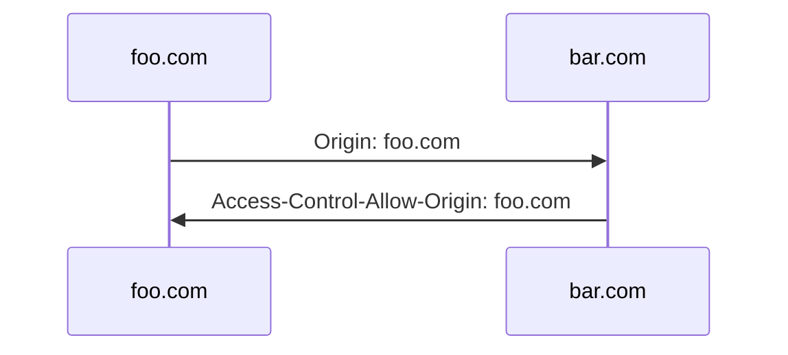
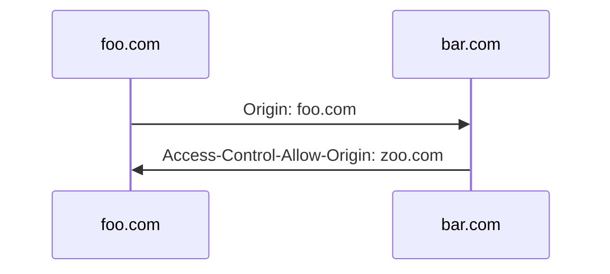
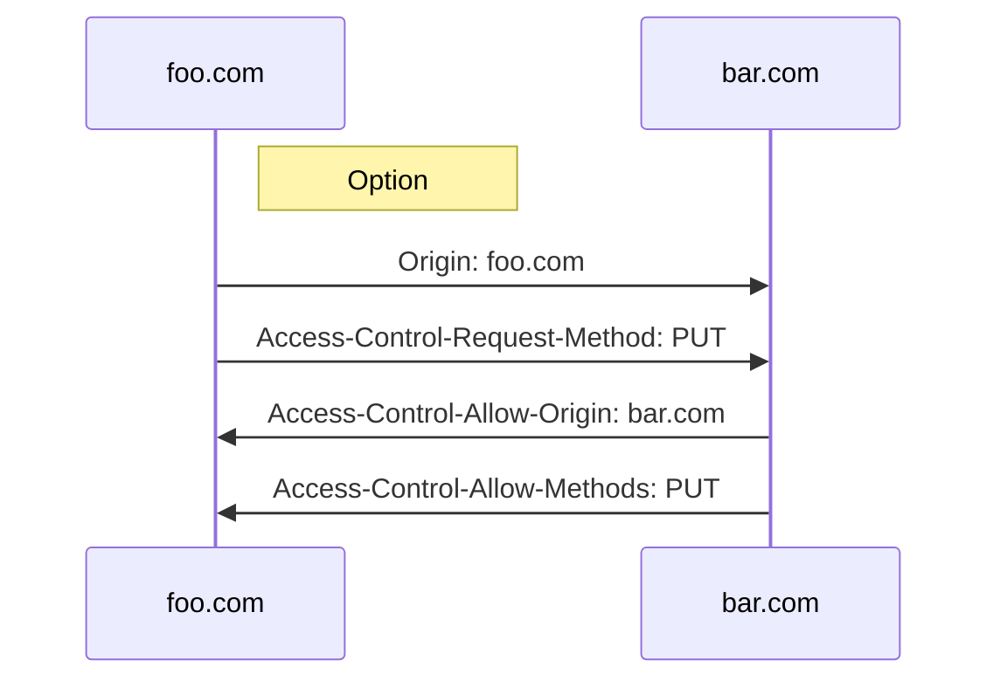
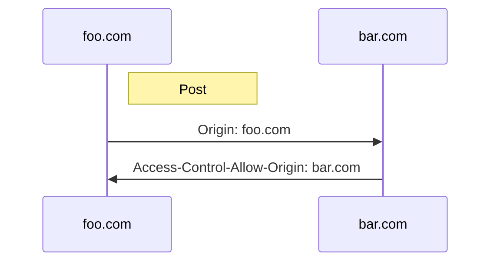

## CORS에러

웹개발을 하다보면 무조건 마주칠 수 밖에 없는 에러중 하나가 CORS 에러다. CORS는 Cross-Origin Resource Sharing 의 줄임말인데, 해석해보면 `교차 출처 자원이 공유` 정도가 되겠다. 브라우저간의 데이터를 주고받는 과정에서, 도메인 이름이 서로 다른 사이트간에 api요청을 할 때, 공유를 설정하지 않았다면 CORS에러가 발생한다.

## CORS에러 해결

브라우저에서 도메인 이름이 서로 다른 사이트를 내가 소유하고 있다면 설정을 통해 CORS에러를 해결할 수 있다. 데이터를 주고 받는 api요청을 할 때, 요청을 주는 쪽의 request 헤더와 요청을 받는 쪽의 response 헤더에 특정 값을 설정하면 된다.

위의 다이어그램에서 request헤더에는 Origin이, response헤더에는 Access-Control-Allow-Origin헤더가 있어야 하며, 이 값이 같거나 Access-Control-Allow-Origin의 경우 `foo.com`대신 `*`를 쓰게 되면, 모든 Origin에 대해 리소스 교환을 허용하겠다는 말이 된다.

## 멱등(GET) vs 비멱등(POST), ...) 요청

Get요청과 그 외의 Post, Put, Delete 등의 요청은 그 성질이 다르다. Get은 서버로 요청을 보낼 때, 서버에 있는 자원에 대한 변경이 없을 때 쓰는 요청 방식이다. 반면 Post등의 요청은 서버의 자원에 대한 변경을 포함하고 있을 수 있다.

Post등의 비멱등 요청의 경우, 서버 자원을 변경시킬 위험이 있으므로 Get에 비해 특별한 케어가 필요하다.

만약, 요청쪽의 Origin과 받는쪽의 Access-Control-Allow-Origin(이하 ACAO)값이 서로 달라서 CORS에러를 발생시키도록 했다고 하자. 요청을 받는 bar.com 사이트 입장에서는 어쨋든 요청을 받을 수밖에 없고, 받은 요청을 바탕으로 허용된 도메인인지 아닌지를 ACAO헤더에 정보를 담아 요청한 브라우저로 보내게 된다. 브라우저는 이 요청을 바탕으로 CORS에러를 낼지, 받은 요청을 허용할지 결정하게 된다.

문제는 Get요청의 경우, 서버 자원을 변경시키지 않지만, Post의 경우, 해당 요청이 허용되지 않은 도메인 임에도 불구하고 서버자원을 변경시킬 수 있다는 점이다. Post 요청으로 서버 자원이 변경된 후, ACAO헤더를 요청 브라우저로 넘겨주면 때는 이미 늦었다. 허용되지 않는 도메인이 서버자원을 변경시키고 만 것이다.

## 비멱등(Post, ...)요청의 CORS 해결책

이를 해결하기 위해 사용하는 방법은 Post, Put, Delete등의 비멱등 요청의 경우, 해당 요청에 앞서 Option으로 요청을 한번 더 보내는 것이다. 이것은 서로 다른 도메인 간의 요청이 허용되는지를 확인하는 handshake 절차이다. 이를 통해 서버 자원이 변경될 위험을 피할 수 있게 된다.

위는 Post요청을 보내기 전 Option요청의 헤더에서 CORS부분을 나타낸 다이어그램이다. 보내는쪽과 받는쪽 모두 서로의 요청을 허용하고 있으므로 handshake가 정상적으로 이뤄졌음을 알 수 있다. 이제 Post요청을 서버 자원 변경에 대한 걱정 없이 할 수 있다.

