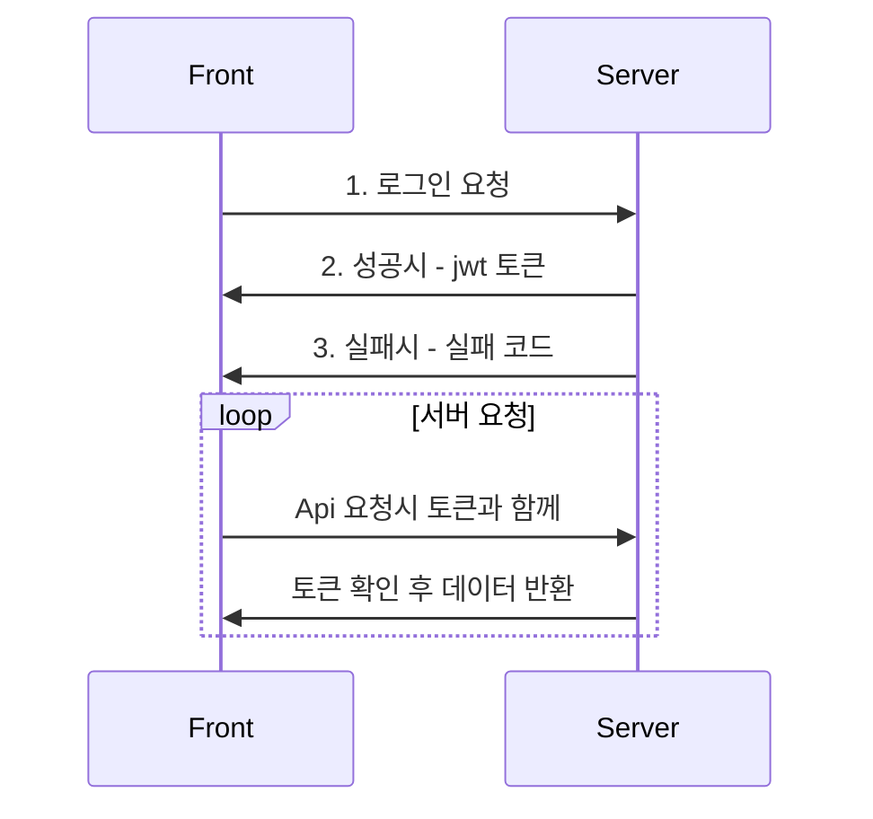

zxcbnzxc

## 로그인 구현 뭘로?

사실 Hugo로 블로그를 만들 기 직전에 Gatsby로 GraphQL도 공부할 겸 블로그를 만들었었다. 코멘트 시스템도 만들고, Admin 페이지까지 만들었는데, 블로그는 Hugo를 사용하는게 훨씬 이득이라는걸 깨닫고, 세상에 공개도 못해보고 폐기해버렸다... 어쨋든 코멘트 시스템을 만들 때, 로그인을 구현해야 할 필요성을 느껴, 간단하게 로그인 할 수 있는 방법을 찾다가 JSON Web Token(jwt)을 사용해서 로그인을 구현하기로 마음먹었다.

## 내가 jwt로 구현한 로직

우선 데이터베이스에 로그인시 사용할 아이디와 비밀번호를 저장했다. 프론트에서 서버로 로그인 요청이 오면, 프론트에서 받은 아이디와 비밀번호를 데이터베이스의 그것과 비교해, 일치하면 토큰을 주고 일치하지 않으면 실패값을 준다. 프론트 쪽에서 jwt 토큰값을 받았다면, 이것을 localStorage에 저장한다. 이제 로그인이 필요한 요청을 프론트에서 서버로 하게되면, 토큰값을 함께 줘서 서버에서 토큰값이 유효한가 판단한다.

## jwt 토큰 만료 처리하기

문제는 토큰이 만료되는 시점에서 생겼다. 토큰을 refresh 시켜주면 되지만, 왜 토큰을 refresh 시켜줘야 하는건지 의문이 생겼다. 이유도 모른채 토큰을 refresh 시켜줄 수는 없다.

### 🔮Refresh token이란?

우선 refresh token의 개념부터 톺아보자. 로그인 요청을 하고 나서, 서버에서 토큰을 프론트로 넘겨줄 때, 토큰을 하나 더 만들어서 넘겨주자.(이전에 토큰 만들었던 방법과 마찬가지로) 하나 더 만든 토큰을 refresh token 이라고 하고 기존에 발행하던 토큰을 access token이라고 해보자. 이름은 중요하지 않다. aws의 cognito에서 이런 이름을 쓰기 때문에 그냥 따라서 쓰겠다.

refresh token은 access token이 만료되었을 때, access token을 다시 발행하기 위한 용도로 쓸 것이기 때문에, access token보다 유효기간이 더 길어야 한다. access token은 유효기간이 짧게 하는게 정석이다. 토큰이 언제 만료될지는 그냥 내 마음대로 access token은 1시간, refresh token은 30일로 정해주겠다. 이제 로그인을 하면, access token 1시간짜리와 refresh token 30일짜리를 리턴값으로 받게되었다. 발급받은 access token과 refresh token을 어떻게 쓸지는, 사용하는 사람에 달려있다. 이 둘은 정확하게 만료일자만 다르고, 나머지는 같은 내용을 담고 있다.

나는 access token을 서버 api를 요청할 때마다 body에 실어 보내고, 서버에서는 이 토큰이 만료가 안됐으면, 유효한 값을 리턴하도록 로직을 구현하겠다. refresh token은 서버 api 요청이 실패했고, 이 실패 사유가 access token의 만료 때문 이라면, 이 refresh token을 사용해 access token을 새로 발급하는 로직을 구현하겠다. 당연히, access 토큰으로 access 토큰을 새로 발급하는 것도 안되고, refresh token으로 api 요청하는것도 안된다. 이것은 서로 다른 토큰이고 내가 그렇게 스왑해서 쓸 수 있게 구현하지 않았다.

대충 이정도가 refresh token을 사용하게 되었을 때 생각해볼 수 있는 시나리오다.

### 🔮Refresh token 필요한가?

세션을 유지한다는 말은, 만료되지 않은 access(혹은 refresh) 토큰값을 프론트에서 가지고 있다는 말이다. 이 토큰이 없으면 로그인이 필요한 서비스를 이용할 수 없다. 그런데, 내가 애초에 가진 의문점은, 왜 access token 만으로 세션 유지가 가능한데, 굳이 refresh token이란 개념이 있냐는 거다. 그냥 처음부터 access token의 만료일자를 1년으로 잡아 놓으면 되지 않겠느냔 말이다. 내가 내린 결론은, <U>refresh token은 필요없다</U>.

### 🔮Stackoverflow 검색

신기하게도, 나와 같은 생각을 했던 사람이 이미 stackoverflow에 질문을 올렸고, 좋은 답변들이 많이 달려 있었다. 참고: 
- [Why Does OAuth v2 Have Both Access and Refresh Tokens?](https://stackoverflow.com/questions/3487991/why-does-oauth-v2-have-both-access-and-refresh-tokens)
- [What's the point of refresh token?](https://stackoverflow.com/questions/10703532/whats-the-point-of-refresh-token)
- [Why use JWT refresh token](https://stackoverflow.com/questions/53324540/why-use-jwt-refresh-token)

1. 많은 사람들이 주장했던 답변은, access 토큰의 경우 로그가 그대로 노출되는 경우가 많은데, 이 토큰의 유효기간을 너무 길게하면 공격자가 이를 악용할 가능성이 커진다는 것이다(access 토큰의 유효기간이 짧을수록 안전하다는 말인듯.). 극단적으로 access 토큰의 유효기간이 5초라고 하면, 확실히 공격자가 이 토큰을 가지고 뭔가 한다는건 힘든 일일 것이다. 

    내 생각 - access 토큰이 노출되는 만큼, refresh 토큰도 노출되어 있으며, 한 단계를 더 거치긴 하지만 공격자 입장에서는 refresh 토큰으로 access 토큰을 얻을 수 있다. 토큰의 유효기간이 1회성 사용 이라면 모를까, 공격자도 사용자 만큼이나 똑같은 조건으로 토큰을 사용할 수 있다.

2. access 토큰을 *사용*하는 쪽이 아니라, *발급*하는 쪽의 입장에서 보자는 주장도 있었다. 만약 access 토큰으로만 세션을 유지하고, 유효기간을 아주 길게 해 놓았다고 해 보자. 그런데 시스템에 문제가 생겨, 일단 모든 세션을 종료시켜야 하는 상황이라고 가정해보자. 만약, access토큰의 유효기간을 아주 길게 해놨다면? 유효한 토큰을 가진 수많은 회원들이 해당 사이트(api)를 이용할 수 있을 것이다. refresh 토큰을 사용하면, access 토큰의 유효기간을 짧게 할 수 있고, 토큰을 관리하는 서버에서 토큰을 재발급 하지 않도록 해서 이 문제를 해결할 수도 있다.

    내 생각 - 유저의 로그인(세션)을 막는 방법은 토큰으로만 가능한게 아니다. 아이디나 이메일로 막을 수도 있다.(그렇게 구현 하기만 하면 된다). 어차피 토큰으로 유저를 블럭 시키거나, 특정인이 발행한 토큰을 무효화 시키려고 할 때, 블랙리스트를 만들거나, 혹은 다른 방식으로 구현해야만한다. 토큰을 사용하면 로직을 구현하는데 특별히 더 쉬운것도 아니다.

jwt 방식은 아니지만, 잘 알려진 OAuth2 제공자 중에 refresh 토큰을 사용하지 않는 제공자는 github과 foursquare가 있다.